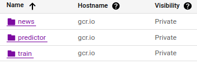

# Exam template for 02476 Machine Learning Operations

This is the report template for the exam. Please only remove the text formatted as with three dashes in front and behind
like:

```--- question 1 fill here ---```

where you instead should add your answers. Any other changes may have unwanted consequences when your report is auto
generated in the end of the course. For questions where you are asked to include images, start by adding the image to
the `figures` subfolder (please only use `.png`, `.jpg` or `.jpeg`) and then add the following code in your answer:

```markdown

```

In addition to this markdown file, we also provide the `report.py` script that provides two utility functions:

Running:

```bash
python report.py html
```

will generate an `.html` page of your report. After deadline for answering this template, we will autoscrape
everything in this `reports` folder and then use this utility to generate an `.html` page that will be your serve
as your final handin.

Running

```bash
python report.py check
```

will check your answers in this template against the constrains listed for each question e.g. is your answer too
short, too long, have you included an image when asked to.

For both functions to work it is important that you do not rename anything. The script have two dependencies that can
be installed with `pip install click markdown`.

## Overall project checklist

The checklist is *exhaustic* which means that it includes everything that you could possible do on the project in
relation the curricilum in this course. Therefore, we do not expect at all that you have checked of all boxes at the
end of the project.

### Week 1

* [x] Create a git repository
* [x] Make sure that all team members have write access to the github repository
* [x] Create a dedicated environment for you project to keep track of your packages
* [x] Create the initial file structure using cookiecutter
* [x] Fill out the `make_dataset.py` file such that it downloads whatever data you need and
* [x] Add a model file and a training script and get that running
* [x] Remember to fill out the `requirements.txt` file with whatever dependencies that you are using
* [x] Remember to comply with good coding practices (`pep8`) while doing the project
* [x] Do a bit of code typing and remember to document essential parts of your code
* [x] Setup version control for your data or part of your data
* [x] Construct one or multiple docker files for your code
* [x] Build the docker files locally and make sure they work as intended
* [x] Write one or multiple configurations files for your experiments
* [-] Used Hydra to load the configurations and manage your hyperparameters
* [x] When you have something that works somewhat, remember at some point to do some profiling and see if
      you can optimize your code
* [x] Use Weights & Biases to log training progress and other important metrics/artifacts in your code. Additionally,
      consider running a hyperparameter optimization sweep.
* [x] Use Pytorch-lightning (if applicable) to reduce the amount of boilerplate in your code

### Week 2

* [x] Write unit tests related to the data part of your code
* [ ] Write unit tests related to model construction and or model training
* [x] Calculate the coverage.
* [x] Get some continuous integration running on the github repository
* [x] Create a data storage in GCP Bucket for you data and preferable link this with your data version control setup
* [x] Create a trigger workflow for automatically building your docker images
* [x] Get your model training in GCP using either the Engine or Vertex AI
* [x] Create a FastAPI application that can do inference using your model
* [ ] If applicable, consider deploying the model locally using torchserve
* [x] Deploy your model in GCP using either Functions or Run as the backend

### Week 3

* [ ] Check how robust your model is towards data drifting
* [ ] Setup monitoring for the system telemetry of your deployed model
* [ ] Setup monitoring for the performance of your deployed model
* [ ] If applicable, play around with distributed data loading
* [ ] If applicable, play around with distributed model training
* [ ] Play around with quantization, compilation and pruning for you trained models to increase inference speed

### Additional

* [ ] Revisit your initial project description. Did the project turn out as you wanted?
* [ ] Make sure all group members have a understanding about all parts of the project
* [ ] Uploaded all your code to github

## Group information

### Question 1
> **Enter the group number you signed up on <learn.inside.dtu.dk>**
>
> Answer:

Group 69

### Question 2
> **Enter the study number for each member in the group**
>
> Example:
>
> *sXXXXXX, sXXXXXX, sXXXXXX*
>
> Answer:

s204119, s204112, s204135, s204141

### Question 3
> **What framework did you choose to work with and did it help you complete the project?**
>
> Answer length: 100-200 words.
>
> Example:
> *We used the third-party framework ... in our project. We used functionality ... and functionality ... from the*
> *package to do ... and ... in our project*.
>
> Answer:

We chose to work with the huggingface transformers framework to perform the natural language processing task of classifying fake or real news articles, based on their titles. From huggingface we use a transformer model, specifically ALBERT, alongside its corresponding tokenizer. The tokenizer encodes the piece of text, we wish to use for our classification task, such that the transformer model can comprehend it.

We also used the PyTorch Lightning framework to reduce boilerplate code.

## Coding environment

> In the following section we are interested in learning more about you local development environment.

### Question 4

> **Explain how you managed dependencies in your project? Explain the process a new team member would have to go**
> **through to get an exact copy of your environment.**
>
> Answer length: 100-200 words
>
> Example:
> *We used ... for managing our dependencies. The list of dependencies was auto-generated using ... . To get a*
> *complete copy of our development enviroment, one would have to run the following commands*
>
> Answer:

Each member had a Python 3.9 virtual environment that we reserved for the project.
We would then pip install the packages defined in the 'requirements.txt' file. If a new package is required, we would push the updated requirements file, and prompt people to install the new packages, such that the environment was up-to-date with the project.
Specifically, they would run ```pip install -r requirements.txt``` inside of their conda environment.

### Question 5

> **We expect that you initialized your project using the cookiecutter template. Explain the overall structure of your**
> **code. Did you fill out every folder or only a subset?**
>
> Answer length: 100-200 words
>
> Example:
> *From the cookiecutter template we have filled out the ... , ... and ... folder. We have removed the ... folder*
> *because we did not use any ... in our project. We have added an ... folder that contains ... for running our*
> *experiments.*
> Answer:

We did utilize the Cookiecutter template. From `/src/data/` we created the raw and processed datasets, and put them in the `/data/` folder. The model checkpoints were saved in the `/models/` folder. The model specification-, training- , and prediction- files were located in the `/src/models/` folder. Most code from here is added to the root folder, or added in new folders, also in the root.
We added a configs directory in root to store the configuration files.
We also added a `utils.py` file to `src` and another `utils.py` to `src/models`

### Question 6

> **Did you implement any rules for code quality and format? Additionally, explain with your own words why these**
> **concepts matters in larger projects.**
>
> Answer length: 50-100 words.
>
> Answer:

We used Black Formatter which let us write a lot of code with out thinking much about the pretty setup.
We used isort which sorts the imports, both in alphabetical order and seperate them by type.
We used Flake8 to conform with official coding standards (PEP8).
It is important to have a guideline when programming. In larger projects code can be confusing if written with different formatting or if the quality of code is changing all the time. In our project the code quality varies, and therefore we help the ones lacking by rewriting what was meant by the code after it was written.
To enforce these standards we used the pre-commit library which required some initial configuration to make them work together without being stuck in a loop of Black and isort reverting each others changes.

## Version control

> In the following section we are interested in how version control was used in your project during development to
> corporate and increase the quality of your code.

### Question 7

> **How many tests did you implement and what are they testing in your code?**
>
> Answer length: 50-100 words.
>
> Example:
> *In total we have implemented X tests. Primarily we are testing ... and ... as these the most critical parts of our*
> *application but also ... .*
>
> Answer:

We implemented multiple tests, which focused on different acpects of the code. Primarily we did unittests on the dataset, because there was alot fiddeling around with it.

While these unit tests for the data were very useful before implementing our Github Action workflows, we were unable to run the dataset test through Github Actions, since getting the dataset on the workflow VM, requires API authentication, which we were unable to do even with the API keys stored in Github secrets.

### Question 8

> **What is the total code coverage (in percentage) of your code? If you code had an code coverage of 100% (or close**
> **to), would you still trust it to be error free? Explain you reasoning.**
>
> Answer length: 100-200 words.
>
> Example:
> *The total code coverage of code is X%, which includes all our source code. We are far from 100% coverage of our **
> *code and even if we were then...*
>
> Answer:

We have a code coverage of 50%, which includes the source code and importantly excludes the test code as to not artificially inflate code coverage.
We're aware that this is on the low side but a lot of the code that isn't tested are the "main" functions such as train_model which might be difficult to implement as a unit test as these functions combines the code of which much of it should have been unit tested.
Even if 100% of our code is covered, we can not guarantee that all edge/corner cases are covered. This is why we should take the coverage measure with a grain of salt.

### Question 9

> **Did you workflow include using branches and pull requests? If yes, explain how. If not, explain how branches and**
> **pull request can help improve version control.**
>
> Answer length: 100-200 words.
>
> Example:
> *We made use of both branches and PRs in our project. In our group, each member had an branch that they worked on in*
> *addition to the main branch. To merge code we ...*
>
> Answer:

Every time we started working on a new feature in the project we created a new branch. After we had implementet that thing and merged we deleted the branch, and created a new one when we started on a new task. We implemented that every pull request should be verified by another member of the group, in that way one person should not be able to mess things up, example like uploading all the data, or deleting/breaking important features. Before the pull request even got to Github we checked the code with pre-commit test.
We also had a Github action to run the unit tests and denied merging until all passed.
We strived for trunk-based development which seems effective for such a fast paced project.

### Question 10

> **Did you use DVC for managing data in your project? If yes, then how did it improve your project to have version**
> **control of your data. If no, explain a case where it would be beneficial to have version control of your data.**
>
> Answer length: 100-200 words.
>
> Example:
> *We did make use of DVC in the following way: ... . In the end it helped us in ... for controlling ... part of our*
> *pipeline*
>
> Answer:

We did use DVC and used it initially to push the data to the GCP bucket.
Since we only pushed the raw data which remained unchanged throughout the project, there wasn't much use for DVC.
In a business scenario the data is much more likely to change. If the company is developing a new project for which data is not readily available, they have to create it themselves and by that, the data is prone to changes in which case data version control is very important.
Using data version control allows one to quickly be able to discern if there are improvements or deteriation of the data. Additionally it can be tracked as a core parameter of ones model as it might change significantly due to changes in the data.

### Question 11

> **Discuss you continues integration setup. What kind of CI are you running (unittesting, linting, etc.)? Do you test**
> **multiple operating systems, python version etc. Do you make use of caching? Feel free to insert a link to one of**
> **your github actions workflow.**
>
> Answer length: 200-300 words.
>
> Example:
> *We have organized our CI into 3 separate files: one for doing ..., one for running ... testing and one for running*
> *... . In particular for our ..., we used ... .An example of a triggered workflow can be seen here: <weblink>*
>
> Answer:

We used unittests and CodeCov in a single workflow file plus some configuration for CodeCov to make it ignore the tests themselves which was very tedious to make work.
We did make use of caches to speed up the process. The workflow file builds a Python 3.9 environment running on Ubuntu.\\
The workflow file can be seen [here](https://github.com/RSM-git/mlops_fake_real_news/blob/main/.github/workflows/tests.yml).
If we also count the pre-commit as CI, then as previously mentioned, we used black, Flake8 and isort.
The pre-commit settings can be seen [here](https://github.com/RSM-git/mlops_fake_real_news/blob/main/.pre-commit-config.yaml).
The important settings are --profile=black in isort, --max-line-length=88 and --extend-ignore=E203 to make the actions work together. Very important to use extend-ignore instead of ignore as otherwise, some already set ignores are overwritten which are necessary since there are at least two standards which contradict eachother.
Without these settings, the pre-commit could loop forever by isort changing one thing and black changing it back etc.
We also update services on the cloud on each push to the Github repository as part of our CI. We automatically built Docker images using the Cloud Build service. Since our Cloud Run app is dependent on the Docker image, we configured permissions for the Cloud Build service, such that it was able to update the Cloud Run instance.


## Running code and tracking experiments

> In the following section we are interested in learning more about the experimental setup for running your code and
> especially the reproducibility of your experiments.

### Question 12

> **How did you configure experiments? Did you make use of config files? Explain with coding examples of how you would**
> **run a experiment.**
>
> Answer length: 50-100 words.
>
> Example:
> *We used a simple argparser, that worked in the following way: python my_script.py --lr 1e-3 --batch_size 25*
>
> Answer:

We used config yaml files to organize experiments.
We loaded the config file and passed it to our wandb logger such that all hyperparameters were logged in W&B.
This is the reason why we decided not to use hydra as wandb can already do everything that we wanted from hydra with the added advantage of having everything stored online.


### Question 13

> **Reproducibility of experiments are important. Related to the last question, how did you secure that no information**
> **is lost when running experiments and that your experiments are reproducible?**
>
> Answer length: 100-200 words.
>
> Example:
> *We made use of config files. Whenever an experiment is run the following happens: ... . To reproduce an experiment*
> *one would have to do ...*
>
> Answer:

We made use of config yaml files, which were passed to the wandb logger, which logs the config file to wandb, to reproduce an experiment one would simply navigate to the wandb experiment run of interest and download the corresponding config file. To further ensure reproducibility we ensured that our experiments were seeded, to make sure that randomness was not a factor.


### Question 14

> **Upload 1 to 3 screenshots that show the experiments that you have done in W&B (or another experiment tracking**
> **service of your choice). This may include loss graphs, logged images, hyperparameter sweeps etc. You can take**
> **inspiration from [this figure](figures/wandb.png). Explain what metrics you are tracking and why they are**
> **important.**
>
> Answer length: 200-300 words + 1 to 3 screenshots.
>
> Example:
> *As seen in the first image when have tracked ... and ... which both inform us about ... in our experiments.*
> *As seen in the second image we are also tracking ... and ...*
>
> Answer:

We ran experiments with the following hyper parameters

| batch_size          | 36    |
|---------------------|-------|
| num_workers         | 8     |
| learning_rate       | 2e-6  |
| accelerator         | "gpu" |
| limit_train_batches | 0.01  |
| limit_val_batches   | 1     |
| max_epochs          | 5     |

All hyperparameters with the exception of limit_train_batches were kept the same across experiments. This was done to track how it would impact the model using smaller fractions of the data. Through out these experiments we tracked the training accuracy, which is important as it reflects whether the model is able to fit to the training data or not. Additionally the validation accuracy was tracked as it shows how well the model is able to generalize to unseen examples. Lastly we tracked the training and validation loss of the model, of which the validation loss is especially important, since an early stopping callback was implemented and as we were able to tell that the quality of the model deteriorated. Below are figures containing the experiments for different fractions of training data supplied to the model. Not all of the models were able to train the full 5 epochs due to the early stopping.


1% training data:


10% training data:


20% training data:


As one would expect, the validation accuracy increases when using a larger percentile of the data, which broadens the space of inputs the model is able to correctly classify and as such reduces overfitting.

### Question 15

> **Docker is an important tool for creating containerized applications. Explain how you used docker in your**
> **experiments? Include how you would run your docker images and include a link to one of your docker files.**
>
> Answer length: 100-200 words.
>
> Example:
> *For our project we developed several images: one for training, inference and deployment. For example to run the*
> *training docker image: `docker run trainer:latest lr=1e-3 batch_size=64`. Link to docker file: <weblink>*
>
> Answer:

We used a Docker image for training, and one for prediction/inference. The trainer file utilizes most files. It needs data files, model files, config files, and other kinds of utility files. The predictor on the other hand only needs to load the model weights to the model. The weights themselves are saved into a GCP bucket, which is can be accessed by the Cloud Run service and can be loaded when the container is built.

<br>
Link to:
Predictor Docker file: <br>
https://github.com/RSM-git/mlops_fake_real_news/blob/main/predictor.dockerfile

Trainer Docker file:<br>
https://github.com/RSM-git/mlops_fake_real_news/blob/main/trainer.dockerfile

### Question 16

> **When running into bugs while trying to run your experiments, how did you perform debugging? Additionally, did you**
> **try to profile your code or do you think it is already perfect?**
>
> Answer length: 100-200 words.
>
> Example:
> *Debugging method was dependent on group member. Some just used ... and others used ... . We did a single profiling*
> *run of our main code at some point that showed ...*
>
> Answer:

We used the debugger, one in the group had problems with the debugger not working and used print states and old ways of debugging.
When debugging Docker containers, it was helpful to utilize caching, such that we would not install 1GB of pytorch and its dependancies on every build.
In general, we tried to make thing work locally, and then deploy to production afterwards. Doing so, will eliminate suspicion of our logical code, and make sure that the remaining error are associated with administrating the cloud services.

## Working in the cloud

> In the following section we would like to know more about your experience when developing in the cloud.

### Question 17

> **List all the GCP services that you made use of in your project and shortly explain what each service does?**
>
> Answer length: 50-200 words.
>
> Example:
> *We used the following two services: Engine and Bucket. Engine is used for... and Bucket is used for...*
>
> Answer:

We used the following services:
- Cloud Run
- Buckets
- Container Registry
- Cloud Build
- (Experimenting with Compute Engines)

Cloud Run is a serverless option for deploying projects. We've used this for inference and deployment. Buckets are used to store data files, as well as the model weights, making it easily accesible for the Cloud Run application. We've automatically built Docker images using Cloud Build, and pushed the containers to the container registry. Cloud Build is also responsible for updating the container used for our Cloud Run app. We tried to train the model using Engines, but had technical troubles; hence we continued training locally on GPUs.

### Question 18

> **The backbone of GCP is the Compute engine. Explained how you made use of this service and what type of VMs**
> **you used?**
>
> Answer length: 100-200 words.
>
> Example:
> *We used the compute engine to run our ... . We used instances with the following hardware: ... and we started the*
> *using a custom container: ...*
>
> Answer:

To train in the Cloud, we used a e2-medium x86/64 cpu machine. We hosted it on europe-west1-b and built it from the train docker image that we had already pushed to the container registry.
This made it really easy to use since we just had to start the machine and it would begin running the container immediately and push the model the bucket.
While we had shown that we were able to train in the Cloud, we chose to do the experiments locally on a GPU machine as this sped up training significantly and reduced the cost.

### Question 19

> **Insert 1-2 images of your GCP bucket, such that we can see what data you have stored in it.**
> **You can take inspiration from [this figure](figures/bucket.png).**
>
> Answer:


### Question 20

> **Upload one image of your GCP container registry, such that we can see the different images that you have stored.**
> **You can take inspiration from [this figure](figures/registry.png).**
>
> Answer:




### Question 21

> **Upload one image of your GCP cloud build history, so we can see the history of the images that have been build in**
> **your project. You can take inspiration from [this figure](figures/build.png).**
>
> Answer:


### Question 22

> **Did you manage to deploy your model, either in locally or cloud? If not, describe why. If yes, describe how and**
> **preferably how you invoke your deployed service?**
>
> Answer length: 100-200 words.
>
> Example:
> *For deployment we wrapped our model into application using ... . We first tried locally serving the model, which*
> *worked. Afterwards we deployed it in the cloud, using ... . To invoke the service an user would call*
> *`curl -X POST -F "file=@file.json"<weburl>`*
>
> Answer:

We've deployed our app (inference) using Cloud Run. Using the FastAPI framework, it is possible to POST a prediction request, containing a news article title as a string. The output will be a string saying either "Real" or "Fake" news. The following curl command is an example of a string, which should return "Real" news: <br>
Text: "AI will contribute positively to society" <br>
`curl -X "POST" "https://predictor-z2dikzecbq-ez.a.run.app/predict/?text=AI%20will%20contribute%20positively%20to%20society" -H "accept: application/json" -d ""`

### Question 23

> **Did you manage to implement monitoring of your deployed model? If yes, explain how it works. If not, explain how**
> **monitoring would help the longevity of your application.**
>
> Answer length: 100-200 words.
>
> Example:
> *We did not manage to implement monitoring. We would like to have monitoring implemented such that over time we could*
> *measure ... and ... that would inform us about this ... behaviour of our application.*
>
> Answer:

We did not implement monitoring of our deployed model. It would be relevant to keep track of inference time, as well as tracking if the model simply doesn't work. This way, we can quickly find possible errors and bottlenecks. This way we can more easily make the user experience better for the user.
Inference time is probably often impacted by the model, networking, or computational resources of the server. All these aspects should be tracked continuously.
It could also be relevant to monitor deployment steps, such as automatic Docker container building, or when we update the Cloud Run service. It's important that our model/product works properly before pushing the final revision to production.
The obvious choice for monitoring framework would be OpenTelemetry, or something similar.

### Question 24

> **How many credits did you end up using during the project and what service was most expensive?**
>
> Answer length: 25-100 words.
>
> Example:
> *Group member 1 used ..., Group member 2 used ..., in total ... credits was spend during development. The service*
> *costing the most was ... due to ...*
>
> Answer:

We can't find a detailed overview of every single members credit usage. However, we did use about 3$ worth of credits.


The table shows how Cloud Storage uses most of our financial resources. This is probably because Docker images/containers are quite large.
| **Service**    | **Price** |
|----------------|-----------|
| Cloud Build    | 0.02$     |
| Cloud Run      | 0.04$     |
| Cloud Storage  | 2.04$     |
| Compute Engine | 0.21$     |
| Networking     | 0.08$     |

And here is a list of prices for each service:


## Overall discussion of project

> In the following section we would like you to think about the general structure of your project.

### Question 25

> **Include a figure that describes the overall architecture of your system and what services that you make use of.**
> **You can take inspiration from [this figure](figures/overview.png). Additionally in your own words, explain the**
> **overall steps in figure.**
>
> Answer length: 200-400 words
>
> Example:
>
> *The starting point of the diagram is our local setup, where we integrated ... and ... and ... into our code.*
> *Whenever we commit code and puch to github, it auto triggers ... and ... . From there the diagram shows ...*
>
> Answer:


The starting point is our local setup.
1) The primary way for local development to reach the cloud, is through the Github repository.
- Before committing to the repo, we have defined a pre-commit hook to take care of formatting before publishing.
- (We use huggingface transformers in the code)
- When we push changes to the repo, Docker containers are automatically built, and pushed to the Cloud Container Registry.
- When containers are updated, so is the Cloud Run app, which is where the inference model is deployed.
2) Training of the model happend in the Compute Engines.
- Due to practical errors, it does require some manual instructions to work proerply
  - This includes pulling Docker images and start the containers, which run the training script
- Training is tracked in Weights and Biases
- The data is loaded from a Bucket, which contains a static dataset from Kaggle
- When training is done, model weights are uploaded to the bucket
3) The user then interacts with our model API
- The model is based on the weights from our bucket, but the model itself is deployed on Cloud Run
- The app uses FastAPI for REST API interaction between server and client
- The client can send a POST request with a string
- The server then respons with a label; either "Real" or "Fake"

### Question 26

> **Discuss the overall struggles of the project. Where did you spend most time and what did you do to overcome these**
> **challenges?**
>
> Answer length: 200-400 words.
>
> Example:
> *The biggest challenges in the project was using ... tool to do ... . The reason for this was ...*
>
> Answer:

The biggest challenges we associated with the Google Cloud Platform. We were able to train models locally, but there was a lot of obstacles when trying to train in the cloud. Somehow we were not able to create a VM-instance from a Docker container. Also, we were simply not able to use Vertex AI. <br>
The overall problem is basically administration in GCP. We can do everything offline, but are limited by GCP.

### Question 27

> **State the individual contributions of each team member. This is required information from DTU, because we need to**
> **make sure all members contributed actively to the project**
>
> Answer length: 50-200 words.
>
> Example:
> *Student sXXXXXX was in charge of developing of setting up the initial cookie cutter project and developing of the*
> *docker containers for training our applications.*
> *Student sXXXXXX was in charge of training our models in the cloud and deploying them afterwards.*
> *All members contributed to code by...*
>
> Answer:

Student s204119 was in charge of merging the data csv files, working with understanding and reading about everything, and help where there else were problems.
\
\
Student s204122 was in charge of deploying an inference model on Cloud Run, as well as working with the Kaggle API to download data, and configuring the initial hydra and docker setup.
\
\
Student s204135 was in charge of implementing the PyTorch Lightning Module and initializing the huggingface model, and setting Cloud Build up for continuous integration / continuous deployment, by running the Cloud Build, which also pushed updates to Cloud Run when changes were pushed to main. Additionally set up CodeCov for the repository, in such a way that unittests weren't counted in the coverage report.
\
\
Student s204141 restructured make_dataset to be class oriented and fixed vital bugs, also changed the download from kaggle to google buckets. Implemented, get_dataloader and the custom collate function.
Set up dvc and uploaded data to the bucket.
Wrote the data utils file.
Did profiling and wrote the make commands for docker and training.
Wrote the train docker file and trained the models.
Implemented pre-commit.
\
\
